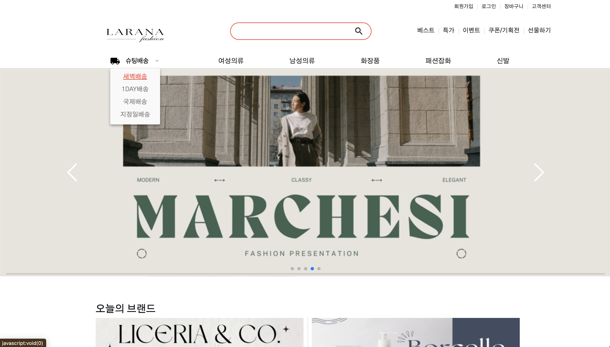
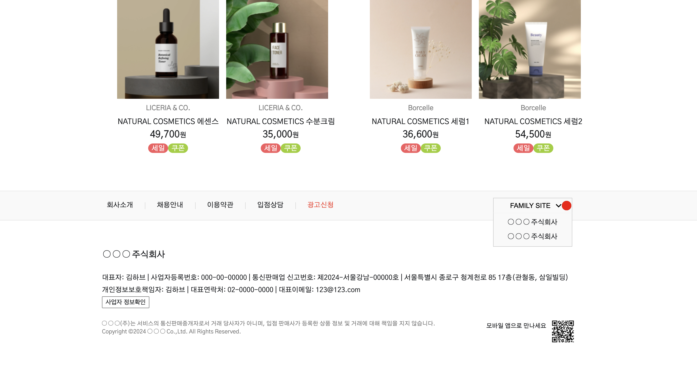

# e-커머스 쇼핑몰 플랫폼

##### 참여자: 김현지 (개인 프로젝트)  
  
#### 프로젝트 기간: 2024.10.20 ~ 2024.11.04 (14일)  
  
#### 프로젝트 도구: Swiper, Google Fonts 및 Material Icons
  
#### 사용 언어: Html, Css, Javascript  
  
### 프로젝트 개요: 
  사용자 친화적인 온라인 쇼핑몰 웹 페이지를 구축하는 것을 목표로 페이지는 헤더, 프로모션 섹션, 상품 리스트와 푸터로 구성.
  더불어 사용자 경험을 향상시키기 위해 Google Fonts와 Material Icons를 활용하여 시각적으로 통일된 스타일을 적용 및 Swiper 슬라이드 통해 생동감 있는 프로모션 배너를 제공.   
  
### 프로젝트 배경  
  다양한 상품을 소개하고 판매하는 플랫폼으로, 시각적으로 심플하며 매력적인 디자인이 필수로 연매출 3조가 넘는 올리브영 상품 리스트 디자인 활용.
  이 프로젝트는 쇼핑몰의 검색, 상품 목록 기능을 직관적이고 쉽게 이용할 수 있는 방식의 배치로 구현 및 브라우저 간의 일관성을 유지하기 위해 Css 리셋을 사용.
#### 사용자 친화적인 쇼핑몰 웹 페이지 구현:  
  - Swiper.js를 이용한 프로모션 배너 슬라이드 기능으로 생동감 있는 사용자 경험 제공
  - Google Fonts와 Material Icons를 통한 일관되고 정돈된 시각 스타일 제공  

#### PC 환경(전체 화면)에 알맞는 디자인:  
  - 브라우저를 전체 화면으로 세팅 후 상품이 화면에서 깔끔하게 보이도록 함
  - reset-css를 통해 크로스 브라우징 유지
  
### 프로젝트 진행 과정  
1. **Html을 통한 페이지 구조화**
  - 헤더에 로고, 회원가입 및 로그인 버튼, 검색 기능, 카테고리 메뉴를 포함한 여러 요소를 배치해 사용자가 필요한 기능을 쉽게 찾을 수 있음.

2. **Css를 이용한 스타일링**
  - Css를 통해 페이지의 레이아웃과 시각적인 디자인 정의.
  - 웹 페이지의 각 요소에 스타일을 적용하여 깔끔하고 일관된 시각적 효과 유지. 

3. Javascript를 이용한 인터랙티브 기능 구현:
  - Swiper.js를 사용해 프로모션 배너 슬라이드 기능 구현.
  - Javascript로 푸터의 "FAMILY SITE" 메뉴를 토글하여 동적인 사용자 경험 및 정돈된 시각적 경험 제공. 

4. **Swiper와 Google Fonts를 이용한 확장성 있는 기능 요소**
  - Swiper 라이브러리를 사용해 슬라이더 기능을 구현해 사용자가 최신 프로모션 정보를 쉽게 접할 수 있도록 함.
  - Google Fonts로 텍스트 스타일을 시각적으로 개선.
  
### 발생 이슈
  - 브라우저 창 축소 시 "product unit row2"가 뷰포트에 고정되어 뷰포트와 함께 이동하는 현상 개선 중.  
  - 브라우저 개발자 도구 확인 시 "footer"가 "product unit row2"과 중복되는 현상 개선 중.
  - 부드러운 스크롤 경험 개선을 통해 사용자 편의성 개선 예정.

  

  
  

  

  

  

  

  
