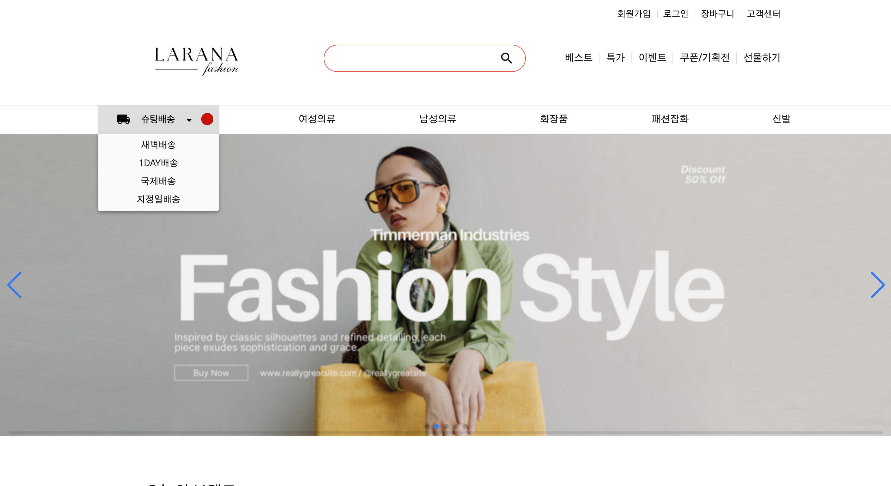
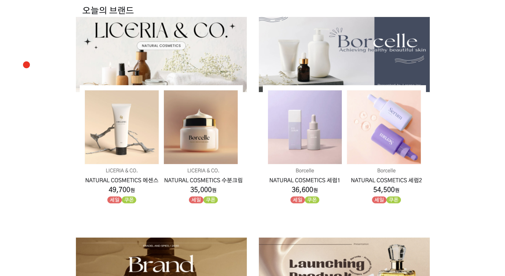

# e-커머스 쇼핑몰 플랫폼
https://taupe-lokum-090ebf.netlify.app/ (PC Ver. 지원가능)

##### 참여자: 김현지 (개인 프로젝트)  
  
#### 프로젝트 기간: 2024.10.20 ~ 2024.11.24
  
#### 프로젝트 도구: GSAP, Swiper.js, Google Fonts, Reset CSS
  
#### 사용 언어: HTML5, CSS3 (SCSS), JavaScript (ES6 이상)  
======================
  
### 1.프로젝트 개요: 
  다양한 제품과 브랜드를 소개하는 온라인 쇼핑몰 웹사이트  
  
  주요 기능:  
  - 사용자 친화적인 탐색 메뉴
  - 다양한 배송 옵션과 프로모션 정보 제공
  - 오늘의 브랜드와 관련된 상품 소개
  - 부드러운 애니메이션 효과와 함께 제품 탐색 경험 제공.  
  ======================
  
### 2.프로젝트 배경  
  사용자 경험(UX)을 중요시하며, 대중적인 디자인 및 상호작용 패턴을 적용하여 웹사이트 접근성을 높이고, 현대적인 쇼핑몰 UI를 구현하고자 했습니다.  
  다양한 JS 라이브러리와 CSS 프레임워크를 활용하여 2차 수정을 통해 코드 간결화를 실현하고, 유지보수성을 강화 하였습니다.  
  사용자가 상품을 쉽고 빠르게 탐색할 수 있도록 직관적이고 간단한 UI를 디자인을 구현하려고 시도하였으며 애니메이션으로 시각적 매력을 추가하였습니다.  
  ======================

#### 2-1.사용자 친화적인 쇼핑몰 웹 페이지 구현:  
  - 쇼핑몰 방문자가 상품을 탐색하고 구매하는 과정을 보다 직관적이고 간단하게 만들어 사용자 만족도를 높임
  - 최신 웹 디자인 트렌드 및 패턴을 사용하여 현대적이고 세련된 UI를 제공
  - 프로모션 슬라이더, 사용자 계정 관리와 같은 필수 기능을 포함하여 고객의 쇼핑 경험 향상.
  - Swiper.js를 이용한 프로모션 배너 슬라이드 기능으로 생동감 있는 사용자 경험 제공  
  ======================

#### 2-2.PC 환경(전체 화면)에 알맞는 디자인:  
  - 브라우저를 전체 화면으로 세팅 후 상품이 화면에서 깔끔하게 보이도록 함
  - reset-css를 통해 크로스 브라우징 유지  
  ======================
  
### 3.프로젝트 진행 과정  
① HTML:  
  - 시멘틱 태그 사용으로 웹 표준을 준수  
  - 프로모션, 제품 카테고리 등 주요 섹션을 구조화  

② CSS/SCSS:  
  - CSS를 통해 페이지의 레이아웃과 시각적인 디자인 정의  
  - SCSS를 활용하여 코드 모듈화 및 유지보수성 향상  
  - Reset CSS로 스타일 초기화  
  - 웹 페이지의 각 요소에 스타일을 적용하여 깔끔하고 일관된 시각적 효과 유지

③ JavaScript:  
  - GSAP 및 Swiper.js로 동적 애니메이션과 슬라이더 구현  
  - 사용자와의 상호작용을 위해 마우스 커서 애니메이션 추가  
  - `footer`의 "FAMILY SITE" 메뉴를 토글하여 동적인 사용자 경험 및 정돈된 시각적 경험 제공

④ 외부 라이브러리 활용:  
  - Swiper.js로 제품 프로모션 섹션 구성  
  - GSAP으로 부드러운 요소 등장 효과 구현  

⑤ 향후 개선 방향  
  - 브라우저 호환성 테스트로 주요 브라우저(Chrome, Firefox, Edge)에서 UI와 기능이 일관되게 작동하는지 개선 필요.  
  - 다양한 디바이스(스마트폰, 태블릿, 데스크톱)에서 반응형 디자인 검증하여 기기 호환성 테스트 필요.  
  - 이미지와 스크립트를 최적화하여 로딩 속도 개선 및 Lighthouse를 활용한 SEO 및 성능 점수 확인으로 성능 최적화 개선 필요.  

⑥ 배포  
  - Netlify를 통해 프로젝트 호스팅  
  - 간단한 도메인 이름 연결 및 배포 상태 확인  
  ======================
  
### 4.트러블슈팅
  #### 4-1.`product unit row2`(브랜드 상품 리스트 2열 두번 째 상품 유닛) 영역이 브라우저 축소 시 왼쪽 영역 위로 겹치는 문제 발생.  
  ======================

  ###### 4-1-1.코드 확인 및 추가 발생 원인 파악  
  HTML 구조 중복 및 계층 이슈  
  중복된 태그가 CSS 스타일을 복잡하게 만들어 레이아웃 충돌 유발.  
  ======================

  ###### 4-1-2.코드 적용 및 결과 확인
  이전 상태:  
  `product unit row`와 `product unit row2`와같이 분리하여 클래스 구분 후 부모 기준으로 `position: absolute;, relative;`로 상품 이미지 유닛 배치.  

  수정 후 상태:    
  `products_unit`으로 상품 리스트 통일 후 `display: grid;`로 열 변경으로 상품 이미지 유닛 배치.  
  ======================

  ###### 4-1-3.결론
  - Lesson Learned
    ① HTML 구조의 단순화는 필수적

      HTML 구조의 중복은 코드 관리의 복잡성을 증가시키고, 스타일 충돌 가능성을 높인다. 유사한 기능이나 요소는 통일된 클래스를 사용하고, 불필요한 중복 태그는 제거하는 것이 중요. 
      
    ② CSS 레이아웃 방식 선택의 중요성  

      `position` 속성은 특정 상황에서 유용하지만, 전체 레이아웃을 관리하기에는 비효율적일 수 있다. 대신, `grid` 또는 `flexbox`와 같은 새로운 레이아웃 방식을 활용하면 더 유연하고 유지보수가 쉬운 레이아웃을 만들 수 있다.  

    ③ 트러블슈팅의 중요성

      문제 해결 과정에서 원인 파악과 해결 방법을 단계적으로 기록하는 것은 앞으로의 개발 과정에서도 향후 빠른 대처를 위해 큰 자산이 된다.  

    ④ 코드 재사용성을 고려한 설계  

      `products_unit`와 같이 통일된 클래스를 사용함으로써, 유지보수와 코드 재사용성이 향상되어 개발 효율성을 높혔다.  
      ======================

  #### 4-2.브라우저 개발자 도구 확인 시 `footer`가 `product unit row2`와 중복되는 이슈.  
  ======================

  ###### 4-2-1.문제 정의
  브라우저 개발자 도구 오픈 시 `footer`가 `product_unit row2`위로 수평 중첩되어 화면 하단에 위치하지 않고 상위 요소와 겹쳐 보이는 문제가 발생.  
  ======================

  ###### 4-2-2.문제의 원인 분석
  `footer`에 적용된 `position: relative;`와 `transform: translateY(350%)` 속성으로 인해, `footer`의 실제 위치가 예상보다 크게 이동.  
  `main`과 같은 상위 요소에서 충분한 높이(`height`) 설정되지 않아 `footer`와 상위 콘텐츠 간 간격이 확보되지 않음.  
  ======================

  ###### 4-2-3.디버깅 과정

  `Footer`의 위치 속성 수정:
  기존의 `position: relative;`와 `transform: translateY;`를 제거하고, 자연스러운 흐름으로 배치되도록 `position`을 조정.  
  ======================

  ###### 4-2-4.코드 적용 및 결과 확인
  `footer`는 상위 콘텐츠와 겹치지 않고, 화면 하단에 정상적으로 배치됨.  
  ======================

  #### 4-3.부드러운 스크롤 경험 개선을 위해 반응형 뷰포트 코드로 수정 진행 중.  
  ======================

  #### 4-4.`.sub-menu` 내부의 <ul> 리스트를 Flex 컨테이너를 사용해 수직 중앙으로 정렬 안됨.  
  ======================
  ###### 4-4-1.문제 정의
  `<ul class="menu_list--promotion_event">`가 부모 요소`.sub-menu`의 수직 중앙에 정렬되지 않고, 상단에 위치.   
  ======================

  ###### 4-4-2.코드 확인 및 추가 발생 원인 파악 
  `.menu_list--promotion_event`에 `display: flex;` 적용되어 text 수평 정렬은 적용되었지만, 부모 요소 `.sub-menu`의 높이에 따른 수직 정렬 설정이 누락되었을 가능성이 있음.
  `.sub-menu`가 Flexbox가 아니어서 전체 높이에서 중앙 정렬이 작동하지 않을 가능성이 있음.  
  ======================

  ###### 4-4-3.문제의 원인 분석
  ① `.sub-menu`의 높이가 명시되지 않았음.   

  기본적으로 HTML 요소는 내용(content)에 맞는 크기를 가진다.  
  `.sub-menu` 내부에는 `<ul>` 리스트만 들어 있기 때문에, `.sub-menu`의 높이는 `<ul>` 콘텐츠 높이만큼만 설정된다.  
  결과적으로 `.sub-menu`의 높이가 `justify-content: center`가 작동할 만큼 충분하지 않는 것이다.  

  ② `Flexbox`가 공간 기준으로 작동함  

  `justify-content`와 `align-items` 속성은 **부모 요소의 가용 공간(남는 여백)**을 기준으로 자식을 정렬한다.  
  그러나 `.sub-menu`의 높이가 자식 콘텐츠와 동일하다면 "남는 공간"이 없어서 정렬이 제대로 작동하지 않는다.  
  ======================

  ###### 4-4-4.디버깅 과정
  ① 개발자 도구(DevTools)로 요소 확인  
    
  `.sub-menu`의 높이가 지정되지 않음. 기본 높이가 콘텐츠의 높이로 제한되고 있어 수직 정렬이 적용되지 않음.  
  `.menu_list--promotion_event`의 `display: flex;`는 가로 방향으로만 작동하고, 세로 방향 정렬은 처리되지 않음.  

  ② CSS 속성 점검  

  `.sub-menu`에 `display: flex;`와 `flex-direction: column;`을 추가하지 않아 수직 중앙 정렬 조건을 충족하지 못함.  
  ======================

  ###### 4-4-5.코드 적용 및 결과 확인
  이전 상태:  
  `<ul class="menu_list--promotion_event">`가 상단에 고정되어 있었음.
  수정 후 상태:  
  `.menu_list--promotion_event`가 `.sub-menu`의 전체 높이 기준으로 수직 중앙에 배치됨.  
  ======================

  ###### 4-4-6.결론

  ① 문제 원인:  
  `.sub-menu`에 Flexbox 레이아웃과 세로 방향 정렬 속성(`flex-direction: column;`, `justify-content: center;`)이 누락됨. 부모 컨테이너에서 수직 중앙 정렬이 불가능한 상태였음.  

  ② 해결 방법:
  `.sub-menu`를 Flexbox로 설정하고, 세로 방향 중앙 정렬 속성을 추가.  
  ======================

  #### 4-5.`.search`와 `.material-icons`의 높이 문제  
  ======================
  ###### 4-5-1.문제 정의
  증상:  
  `input`의 높이는 정상적으로 `3.25em`로 설정되었으나, `.search`와 `.material-icons`의 높이가 `input`보다 더 크게 설정되어 레이아웃이 어긋나는 문제 발생.  
  ======================
  ###### 4-5-2.문제의 원인 분석
  ① `bottom` 속성의 영향  

  `.search`와 `.material-icons`에서 `position: absolute;`로 설정된 상태에서 `top`과 `bottom`이 동시에 지정되어 있었다.  
  `top`과 `bottom`이 지정되면 요소의 높이(`height`)가 부모 요소에 종속되지 않고, `top`과 `bottom`의 거리만큼 확장된다.  

  ② 불필요한 레이아웃 설정  

  `.material-icons`에 `margin: auto;`와 함께 `top`과 `bottom`이 지정되어 있어, 아이콘의 위치뿐만 아니라 크기에도 영향을 미쳤다.  

  ③ 부모 요소 크기와 자식 요소의 불일치

  `.search`에 높이가 명시되지 않고 `top`과 `bottom`으로만 크기가 결정되었으며, 이로 인해 input과 다른 높이를 가지게 되었다.  
  ======================

  ###### 4-5-3.코드 적용 및 결과 확인
  ① 문제 원인 검증  

  `.search`와 `.material-icons`의 `bottom` 속성을 제거하자, 높이가 `input`과 동일해짐을 확인.  
  이는 `top`과 `bottom`으로 높이가 과도하게 설정되었음을 확인 됨.  

  ② `bottom` 제거  

  `.search`와 `.material-icons`에서 `bottom` 속성을 제거하여 요소의 크기를 의도한 대로 제한.  

  ③ 레이아웃 개선

  flexbox를 사용하여 `.search` 내에서 `input`과 `.material-icons`의 정렬을 간소화.  
  불필요한 위치 관련 속성(`top`, `bottom`, `margin`)을 제거하고, 아이콘 크기는 `font-size`로 제어 함.  
  ======================
  
  ###### 4-5-4.트러블슈팅의 교훈
  `position: absolute;`와 `top`, `bottom`의 조합을 사용할 때, 요소의 크기(`height`)에 미치는 영향을 주의 깊게 살펴봐야 한다.  
  복잡한 레이아웃 설정 대신 flexbox를 활용하면, 자식 요소 정렬과 크기 조정이 훨씬 간단해진다.  
  항상 문제의 원인을 단계적으로 확인하고, 작은 수정으로 해결 여부를 검증하며 진행해야 한다.  
  첫 트러블슈팅 문서화 작업으로 오류 상황 및 코드 상황을 상세하게 기재하지 못한 점이 아쉬웠다.  
  오류 상황 발생 시 코드와 함께 기록하는 문서화가 필요하다.  
  ======================

  

  
  

  

  

  

  

  
